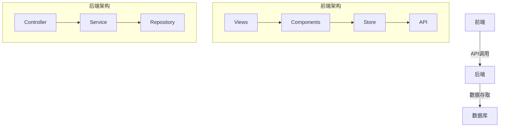
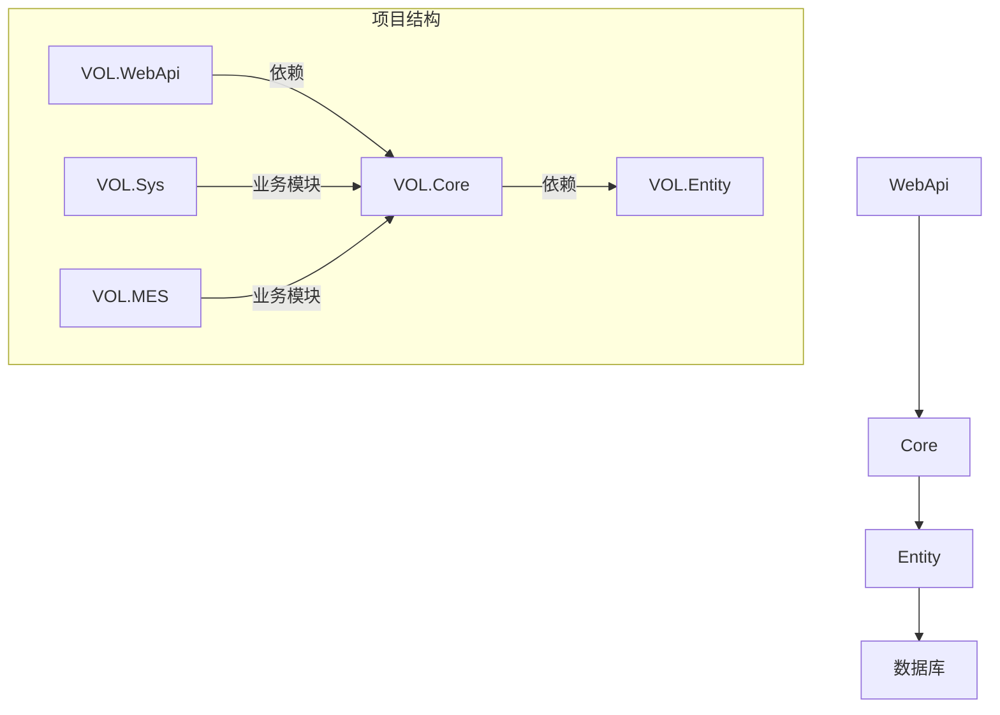
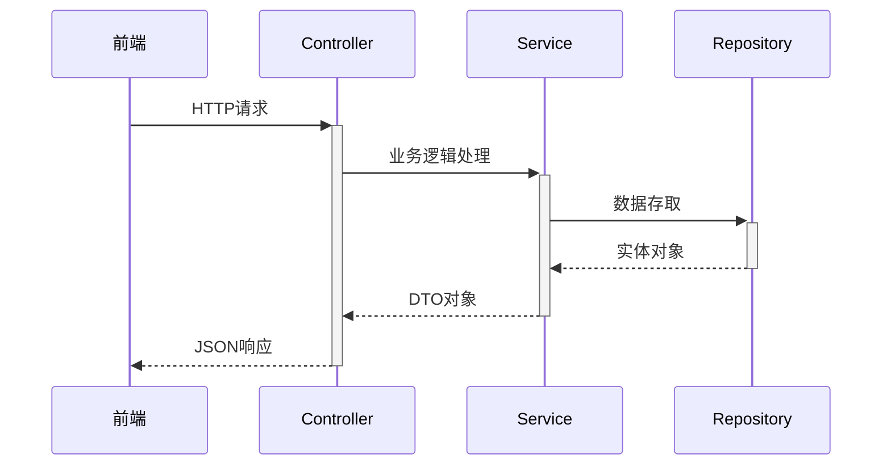
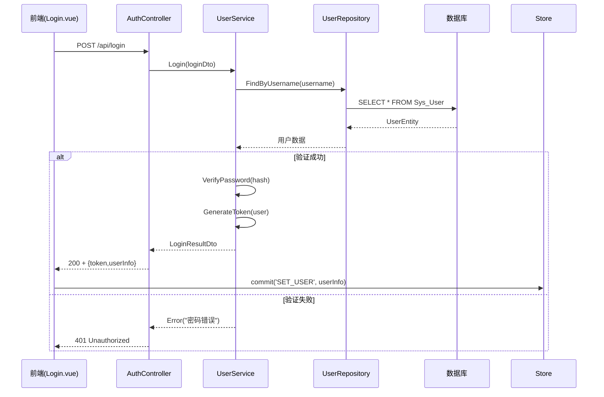
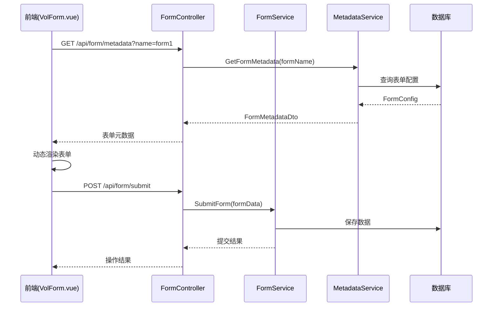
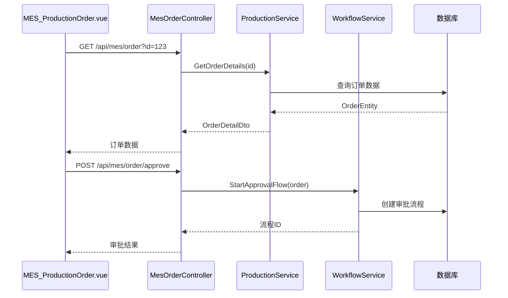

# CCIOFFICE.NETCORE 二次开发指南

## 一、技术栈与架构

### 1.1 技术栈

- **前端框架**: Vue 3 + Element Plus
- **状态管理**: Vuex/Pinia (基于stores目录结构)
- **构建工具**: Vite (基于项目结构推断)
- **CSS预处理器**: Less
- **图标库**: Bootstrap Icons + Element Icons

### 1.2 分层架构



### 1.3 核心设计模式

1. **MVVM模式**:

   - View: Vue组件(Views目录)
   - ViewModel: VolForm/VolTable等组件
   - Model: API返回数据
2. **组件化开发**:

   - 基础组件: components/basic
   - 业务组件: components/extension
3. **状态集中管理**:

   - 通过stores/modules管理全局状态

## 二、核心文件结构

### 2.1 前端核心模块

（已有内容保持不变）

### 2.2 后端核心模块

#### 分层架构



#### 核心项目说明

1. **VOL.WebApi**:

   - API入口项目
   - 包含Controllers和启动配置
   - 关键文件：`Startup.cs`、`appsettings.json`
2. **VOL.Core**:

   - 核心业务逻辑
   - 包含Services、Repositories
   - 关键类：`BaseServices.cs`（基础服务）
3. **VOL.Entity**:

   - 数据库实体类
   - 使用EF Core的DbSet定义
   - 关键文件：`VOLContext.cs`
4. **VOL.Sys**:

   - 系统管理模块
   - 包含用户、角色等系统服务
5. **VOL.MES**:

   - MES业务模块
   - 生产制造执行系统相关逻辑

#### 典型API调用链



#### 页面组件架构

- 主框架: `views/index/Index.vue`
- 登录页: `views/Login.vue`
- MES模块: `views/mes/mes/*`
- 系统管理: `views/sys/*`

#### 状态管理

- 用户状态: `stores/modules/user.ts`
- 权限控制: `components/VolProvider/VolPermission.js`

#### API调用体系

- 基础请求: `src/api/http.js`
- 权限相关: `src/api/permission.js`
- 业务按钮: `src/api/buttons.js`

### 2.2 后端核心模块

（待补充后端项目分析）

## 三、关键业务流程

### 3.1 用户登录流程（详细版）



**关键代码路径**:

- 前端登录页: `views/Login.vue`
- API端点: `VOL.WebApi/Controllers/AuthController.cs`
- 服务实现: `VOL.Core/Services/UserService.cs`
- 密码验证: `VOL.Core/Utils/CryptoHelper.cs`

### 3.2 表单生成流程



**关键组件**:

- 表单渲染: `components/basic/VolForm/VolForm.vue`
- 表单配置: `components/basic/VolForm/VolFormProps.js`
- 后端服务: `VOL.Core/Services/FormService.cs`

### 3.3 MES生产订单流程



**关键文件**:

- 页面组件: `views/mes/mes/MES_ProductionOrder.vue`
- 业务逻辑: `VOL.MES/Services/ProductionService.cs`
- 工作流引擎: `VOL.Core/Services/WorkflowService.cs`

## 四、扩展开发指南

### 4.1 关键配置项说明

#### 前端配置

```javascript
// src/api/http.js 基础配置
const service = axios.create({
  baseURL: process.env.VUE_APP_BASE_API,
  timeout: 10000,
  withCredentials: true
})
```

#### 后端配置

```json
// VOL.WebApi/appsettings.json
{
  "JwtSettings": {
    "Secret": "your-secret-key",
    "ExpiryMinutes": 120
  },
  "ConnectionStrings": {
    "DefaultConnection": "Server=.;Database=VOL;Trusted_Connection=True;"
  }
}
```

### 4.2 示例代码片段

#### 前端组件示例

```vue
<!-- 新建页面示例 -->
<template>
  <vol-table :columns="columns" :url="url"></vol-table>
</template>

<script>
import { defineComponent } from 'vue'
export default defineComponent({
  setup() {
    return {
      columns: [
        { field: 'id', title: 'ID' },
        { field: 'name', title: '名称' }
      ],
      url: '/api/sample/list'
    }
  }
})
</script>
```

#### 后端服务示例

```csharp
// 新建Service示例
public class SampleService : BaseService<SampleEntity>
{
    public SampleService(IRepository<SampleEntity> repository) 
        : base(repository)
    {
    }

    public async Task<PageResult<SampleDto>> GetListAsync(PageRequest request)
    {
        return await Repository.Query()
            .WhereIf(!string.IsNullOrEmpty(request.Keyword), 
                x => x.Name.Contains(request.Keyword))
            .ToPageResultAsync<SampleEntity, SampleDto>(request);
    }
}
```

### 4.3 添加新页面步骤

（保持原有内容不变）

### 4.4 防坑指南

（保持原有内容不变）

### 4.1 添加新页面步骤

1. 在 `views`下创建新目录
2. 添加路由配置 `router/index.js`
3. 创建对应的API方法 `api/*.js`
4. 如需新组件，在 `components`下创建

### 4.2 防坑指南

1. 表单验证:
   - 必须参考 `components/basic/VolForm/VolFormItemRule.js`
2. 表格定制:
   - 参考 `components/basic/VolTable`中的各种mixins
3. API调用:
   - 必须使用 `src/api/http.js`封装的请求方法
