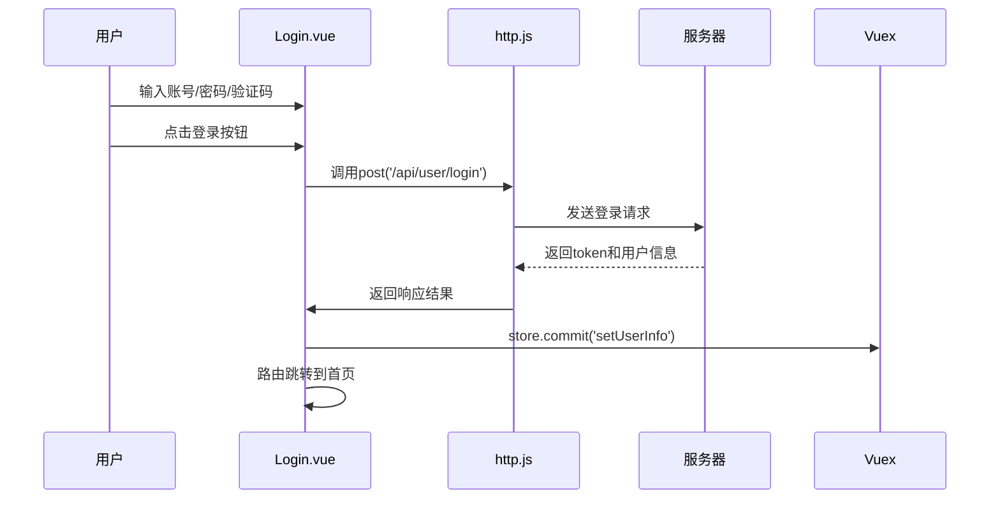
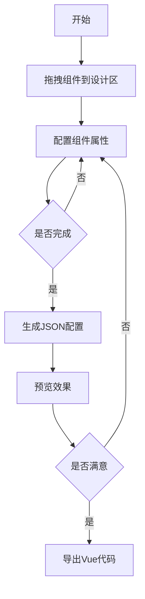
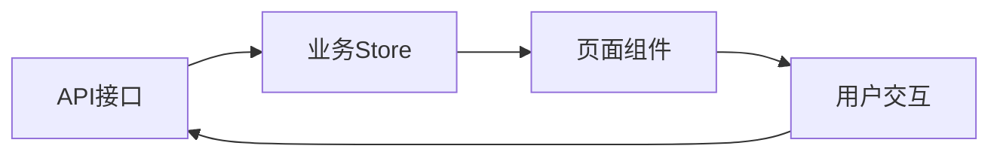

# HXSmartConstruct 低代码平台前端项目架构说明书

## 目录

1. [项目整体结构](#项目整体结构)
2. [核心功能模块](#核心功能模块)
   - [用户登录流程](#用户登录流程)
   - [VUE页面生成功能](#vue页面生成功能)
   - [实体类生成流程](#实体类生成流程)
   - [业务类生成流程](#业务类生成流程)
3. [关键组件说明](#关键组件说明)
4. [API接口规范](#api接口规范)
5. [开发规范](#开发规范)

## 项目整体结构

### 主要目录说明

```
.
├── public/                # 静态资源
│   ├── static/            # 静态文件
│   │   ├── imgs/          # 图片资源
│   ├── favicon.ico        # 网站图标
│   └── vol.css           # 全局CSS
├── src/                   # 核心源代码
│   ├── api/               # API接口
│   │   ├── http.js        # 请求封装
│   ├── assets/            # 静态资源
│   ├── components/        # 公共组件
│   │   ├── basic/         # 基础组件
│   │   │   ├── VolForm/   # 表单组件
│   │   │   ├── VolTable/  # 表格组件
│   ├── router/            # 路由配置
│   ├── store/             # 状态管理
│   ├── utils/             # 工具函数
│   └── views/             # 页面视图
│       ├── login/         # 登录页
│       └── builder/       # 代码生成器
```

## 用户登录流程

### 核心代码文件

- `src/views/Login.vue` - 登录页面
- `src/api/http.js` - 请求封装
- `src/store/index.js` - 状态管理

### 执行时序



### 详细流程说明

1. **初始化验证码**

```javascript
// Login.vue中初始化验证码
const getVierificationCode = () => {
  http.get("/api/User/getVierificationCode").then((x) => {
    codeImgSrc.value = "data:image/png;base64," + x.img;
    userInfo.UUID = x.uuid; // 保存验证码UUID
  });
};
```

2. **登录请求处理**

```javascript
// http.js中的请求拦截
axios.interceptors.request.use((config) => {
  if (store.getters.token) {
    config.headers['Authorization'] = store.getters.token;
  }
  return config;
});
```

3. **响应处理**

```javascript
// http.js中的响应拦截
axios.interceptors.response.use(
  (response) => {
    if (response.headers.vol_exp === '1') {
      // token过期时自动刷新
      replaceToken(); 
    }
    return response;
  },
  (error) => {
    if (error.response.status === 401) {
      toLogin(); // 跳转登录页
    }
    return Promise.reject(error);
  }
);
```

4. **用户信息存储**

```javascript
// store/index.js中的mutation
const mutations = {
  setUserInfo(state, userInfo) {
    state.token = userInfo.token;
    state.userInfo = userInfo;
    localStorage.setItem('userInfo', JSON.stringify(userInfo));
  }
}
```

5. **路由守卫验证**

```javascript
// router/index.js中的全局守卫
router.beforeEach((to, from, next) => {
  if (to.meta.requiresAuth && !store.getters.token) {
    next('/login');
  } else {
    next();
  }
});
```

## VUE页面生成功能

### 核心组件

- `src/components/basic/VolFormDraggable` - 表单设计器
- `src/views/builder/` - 代码生成器
- `src/components/basic/VolTable` - 表格组件
- `src/components/editor/VolWangEditor` - 富文本编辑器

### 设计器工作流程



### 详细实现

1. **组件拖拽实现**

```javascript
// VolFormDraggable.vue中的拖拽配置
const draggableOptions = {
  group: {
    name: 'componentsGroup',
    pull: 'clone',
    put: false
  },
  animation: 300,
  sort: false
}
```

2. **组件属性配置**

```javascript
// 表单组件数据结构
{
  field: 'field1', // 字段名
  name: '用户名',  // 显示名称
  type: 'text',    // 组件类型
  required: true,  // 是否必填
  readonly: false, // 是否只读
  width: 100,      // 宽度百分比
  data: []         // 下拉框等组件的数据源
}
```

3. **预览功能实现**

```javascript
const preview = () => {
  const formOptions = currentComponents.map(item => ({
    field: item.field,
    title: item.name,
    type: item.type,
    required: item.required,
    data: item.data
  }));
  viewFormData.value = { fields: {}, formOptions };
}
```

4. **代码生成**

```javascript
// 生成Vue模板代码
const generateTemplate = () => {
  return `
    <template>
      <vol-form :form-options="formOptions" v-model="formData">
        <template #buttons>
          <el-button @click="submit">提交</el-button>
        </template>
      </vol-form>
    </template>
  `;
}

// 生成Script代码 
const generateScript = () => {
  return `
    <script>
    export default {
      data() {
        return {
          formData: ${JSON.stringify(viewFormData.value.fields)},
          formOptions: ${JSON.stringify(viewFormData.value.formOptions)}
        }
      },
      methods: {
        submit() {
          this.$http.post('/api/submit', this.formData)
        }
      }
    }
    </script>
  `;
}
```

### 组件配置示例

```javascript
// 下拉框组件配置示例
{
  type: 'select',
  name: '性别',
  field: 'gender',
  data: [
    { label: '男', value: 1 },
    { label: '女', value: 2 }
  ],
  width: 50,
  required: true
}

// 表格组件配置示例
{
  type: 'table',
  name: '用户列表',
  url: '/api/user/getPageData',
  columns: [
    { field: 'name', title: '姓名' },
    { field: 'age', title: '年龄' }
  ],
  buttons: [
    { name: '添加', action: 'add' },
    { name: '删除', action: 'delete' }
  ]
}
```

### 设计器界面说明

1. **左侧面板**：可拖拽组件列表，包含基础表单组件和布局组件
2. **中间设计区**：拖拽生成的组件预览和排序区域
3. **右侧属性面板**：当前选中组件的属性配置区域
4. **顶部工具栏**：保存、预览、清空等操作按钮

## 实体类生成流程

### 核心文件结构

```
src/extension/
├── sys/                # 系统模块实体
│   ├── flow/           # 工作流实体
│   ├── form/           # 表单设计实体
│   ├── system/         # 系统管理实体
└── mes/                # MES模块实体
    ├── production/      # 生产管理
    └── quality/        # 质量管理
```

### 生成流程详解

1. **实体定义**

```javascript
// src/extension/sys/system/Sys_User.jsx
export default {
  name: '用户管理',
  columns: [
    { field: 'UserName', title: '账号', width: 120 },
    { field: 'RoleName', title: '角色', width: 120 }
  ],
  api: {
    getPageData: '/api/Sys_User/getPageData',
    update: '/api/Sys_User/update'
  }
}
```

2. **代码生成器处理**

```javascript
// 生成Vue组件模板
const generateVueTemplate = (entity) => {
  return `
    <template>
      <vol-table :columns="columns" :url="url"></vol-table>
    </template>
  `;
}

// 生成API文件
const generateApiFile = (entity) => {
  return `
    export default {
      getPageData(params) {
        return http.post('${entity.api.getPageData}', params)
      },
      update(data) {
        return http.post('${entity.api.update}', data)
      }
    }
  `;
}
```

3. **输出文件结构**

```
views/
└── sys/
    └── system/
        ├── Sys_User.vue      # 生成的页面组件
        └── api.js            # 生成的API文件
```

### 实体配置项说明

| 配置项  | 类型    | 说明               |
| ------- | ------- | ------------------ |
| name    | String  | 实体显示名称       |
| columns | Array   | 表格列配置         |
| api     | Object  | 接口地址配置       |
| buttons | Array   | 自定义操作按钮     |
| tabs    | Boolean | 是否使用选项卡布局 |

### 示例：生成带选项卡的实体

```javascript
{
  name: '订单管理',
  tabs: true,
  children: [
    {
      name: '订单基本信息',
      columns: [...]
    },
    {
      name: '订单明细',
      columns: [...]
    }
  ]
}
```

## 业务类生成流程

### 核心架构



### 1. API层实现

#### 基础API封装

```javascript
// src/api/http.js
const http = {
  get(url, params, loading) {
    return axios.get(url, { params });
  },
  
  post(url, data, loading) {
    return axios.post(url, data);
  },
  
  put(url, data, loading) {
    return axios.put(url, data);
  },
  
  delete(url, params, loading) {
    return axios.delete(url, { params });
  }
}
```

#### 业务API示例

```javascript
// src/api/system/user.js
export default {
  // 分页查询
  getPageList(params) {
    return http.post('/api/user/getPageData', params);
  },
  
  // 新增用户
  addUser(data) {
    return http.post('/api/user/add', data);
  },
  
  // 更新用户
  updateUser(data) {
    return http.put('/api/user/update', data);
  }
}
```

### 2. 状态管理实现

#### Store模块定义

```javascript
// src/stores/modules/user.js
const state = {
  userList: [],
  currentUser: null
}

const mutations = {
  SET_USER_LIST(state, list) {
    state.userList = list;
  },
  
  SET_CURRENT_USER(state, user) {
    state.currentUser = user;
  }
}

const actions = {
  async fetchUserList({ commit }, params) {
    const res = await userApi.getPageList(params);
    commit('SET_USER_LIST', res.data);
    return res;
  },
  
  async updateUser({ commit }, data) {
    const res = await userApi.updateUser(data);
    commit('SET_CURRENT_USER', data);
    return res;
  }
}

export default {
  namespaced: true,
  state,
  mutations,
  actions
}
```

### 3. 页面组件集成

#### 组件中使用示例

```javascript
// views/system/user.vue
export default {
  setup() {
    const store = useStore();
  
    // 获取用户列表
    const loadData = async () => {
      await store.dispatch('user/fetchUserList', {
        page: 1,
        rows: 20
      });
    }
  
    // 更新用户信息
    const updateUser = async (data) => {
      await store.dispatch('user/updateUser', data);
    }
  
    return {
      loadData,
      updateUser
    }
  }
}
```

### 4. 权限控制实现

#### 路由权限配置

```javascript
// src/router/index.js
{
  path: '/user',
  component: User,
  meta: {
    requiresAuth: true,
    permission: 'system:user'
  }
}
```

#### 权限指令实现

```javascript
// src/directives/permission.js
export default {
  mounted(el, binding) {
    const { value } = binding;
    const permissions = store.getters.permissions;
  
    if (!permissions.includes(value)) {
      el.parentNode.removeChild(el);
    }
  }
}
```

### 5. 错误处理机制

#### 全局错误拦截

```javascript
// src/api/http.js
axios.interceptors.response.use(
  response => response,
  error => {
    if (error.response.status === 500) {
      Message.error('服务器内部错误');
    }
    return Promise.reject(error);
  }
);
```

#### 业务错误处理

```javascript
// 组件中使用
const updateUser = async () => {
  try {
    await store.dispatch('user/updateUser', formData);
    Message.success('更新成功');
  } catch (error) {
    console.error('更新失败:', error);
  }
}
```

## 关键组件说明

### VolFormDraggable 表单设计器

- 基于vue-draggable-next实现拖拽功能
- 支持组件属性配置
- 可导出JSON配置和Vue代码

### VolTable 表格组件

- 支持分页、排序、筛选
- 内置多种操作按钮
- 可配置列显示

## API接口规范

1. 请求方法：

   - GET：查询
   - POST：创建
   - PUT：更新
   - DELETE：删除
2. 响应格式：

```json
{
  "status": true,
  "message": "操作成功",
  "data": {}
}
```

## 开发规范

1. 组件命名：大驼峰式(如VolForm)
2. 变量命名：小驼峰式
3. 目录命名：小写字母+连字符
4. 代码风格：遵循ESLint配置
